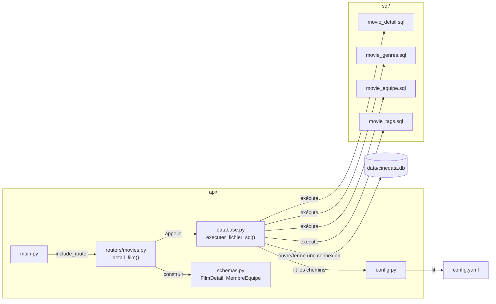
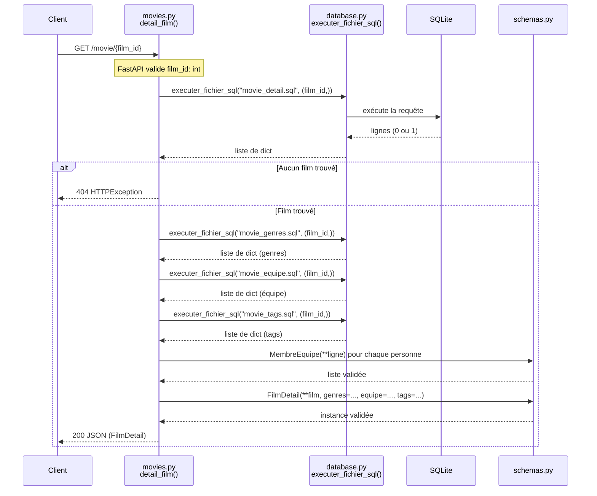

# Guide étudiant — API REST avec FastAPI
## Jour 4 · Projet CinéData

---

## Introduction

Vos données sont chargées en base (étape Load, atelier précédent). Cet atelier les rend accessibles via une API REST, pour qu'un autre composant — un futur module IA, une application front — puisse les consommer sans accès direct à votre base de données.

---

## Concepts

FastAPI est un framework Python pour construire des API REST. Trois notions structurent le projet aujourd'hui :

- **Router** : un regroupement de routes liées entre elles (ex. tout ce qui concerne les films dans un fichier, tout ce qui concerne les classements dans un autre). Chaque router peut être « taggé », ce qui détermine aussi son regroupement dans la documentation Swagger.
- **Modèle Pydantic** : une classe qui décrit la forme exacte d'une donnée (quels champs, quels types). FastAPI l'utilise pour valider automatiquement ce qu'une route retourne, et pour générer la documentation.
- **`response_model`** : indiqué sur chaque route, il dit à FastAPI quel modèle Pydantic valider en sortie.

## Définitions

| Terme | Signification |
|---|---|
| Route / endpoint | Une URL associée à une fonction Python qui y répond |
| `APIRouter` | Un regroupement de routes, inclus ensuite dans l'application principale |
| Modèle Pydantic (`BaseModel`) | Une classe qui définit la structure et les types attendus d'une donnée |
| `response_model` | Le modèle Pydantic utilisé pour valider/documenter la sortie d'une route |
| Path parameter | Une valeur intégrée dans l'URL (ex. `/movie/{film_id}`) |
| Query parameter | Un paramètre optionnel après `?` dans l'URL (ex. `?page=2`) |
| Swagger | Documentation interactive générée automatiquement par FastAPI, accessible sur `/docs` |

---

## Mise en œuvre

### 1. Structure du projet

```
api/
├── main.py          # crée l'application, inclut les routers
├── config.py         # charge config.yaml
├── database.py         # exécute les fichiers .sql
├── schemas.py           # tous les modèles Pydantic
└── routers/
    ├── system.py         # /info /health
    ├── movies.py          # /movie/ /movie/{id}
    └── rankings.py         # /top_*
```

Chaque route suit le même principe : elle appelle une ou plusieurs requêtes `.sql` (dossier `sql/`) via `executer_fichier_sql()`, construit un modèle Pydantic avec le résultat, et le retourne — FastAPI se charge de la conversion en JSON et de la validation.

### 2. Lancer l'API

Depuis la racine du projet :
```bash
uvicorn main:app --reload --app-dir api
```

Documentation interactive : `http://127.0.0.1:8000/docs`. Les 3 sections (Système/Films/Classements) correspondent aux 3 fichiers de `routers/`.

### 3. Suivre l'exemple `/movie/{film_id}`

Cette route illustre l'enchaînement complet :
1. `film_id: int` dans la signature → FastAPI valide automatiquement le type
2. Une requête `.sql` pour le film lui-même, une pour ses genres, une pour son équipe, une pour ses tags — 4 requêtes plutôt qu'une seule jointure, pour éviter la multiplication de lignes qu'une jointure sur plusieurs relations N-N provoquerait
3. Si le film n'existe pas → `HTTPException(status_code=404, ...)`
4. Assemblage dans le modèle Pydantic `FilmDetail`, qui valide que tout est cohérent avant de répondre

**Dépendances entre fichiers** (qui appelle/importe quoi) :



**Déroulement d'une requête** (l'ordre réel des appels, avec le cas film non trouvé) :



Ce second diagramme montre bien que `database.py` ouvre et referme une connexion à **chacun** des 4 appels — un choix volontairement simple (pas de connexion partagée à gérer), au prix de 4 ouvertures/fermetures au lieu d'une seule.

### 4. Exercice — à construire vous-même

Sur votre propre projet (adaptez aux noms de colonnes de votre propre schéma, qui peut différer de l'exemple) :

1. **`/info`** et **`/health`** — informations libres, `/health` doit vérifier une vraie requête sur votre base
2. **`/movie/`** avec pagination : 10 films par page, un paramètre `page` en query parameter, en vous inspirant des requêtes `movies_list.sql`/`movies_count.sql`
3. **Une route de classement** (`top_actor`, `top_director`, `top_revenue` ou `top_budget`) : écrivez la requête SQL correspondante (`GROUP BY` + comptage, ou simple tri + `LIMIT`), puis la route qui l'expose

### Point de vigilance

Les placeholders `?` dans vos requêtes SQL (jamais de valeur utilisateur insérée directement dans la chaîne de requête) protègent contre l'injection SQL — un réflexe à garder pour toute requête paramétrée, dans ce projet comme ailleurs.

---

## Ressource complémentaire

**[Documentation officielle FastAPI](https://fastapi.tiangolo.com/fr/)** (en français) — voir en particulier "Path Parameters", "Query Parameters" et "Response Model".
