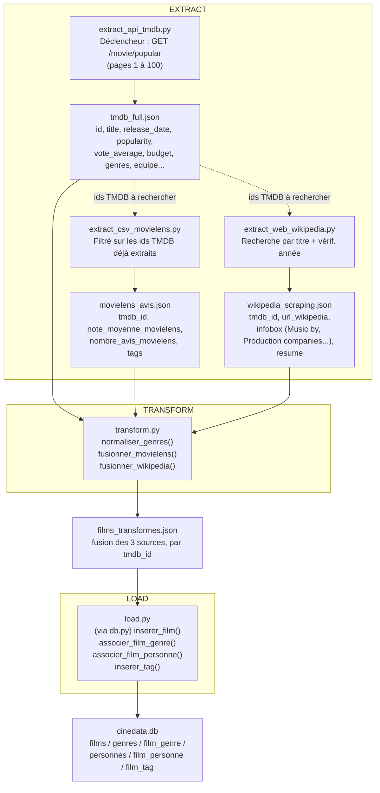
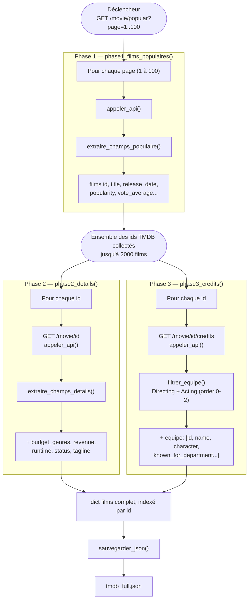

# Pipeline ETL — CinéData

Documentation du process ETL (Extract / Transform / Load) construit pour ce projet.

## 1. Vue d'ensemble du pipeline

Trois branches d'extraction indépendantes convergent vers une étape de transformation unique, puis un chargement en base. **La branche API TMDB est la source principale et déclenche les deux autres** : `extract_csv_movielens.py` et `extract_web_wikipedia.py` se basent tous les deux sur la liste des identifiants de films déjà extraits par `extract_api_tmdb.py` (via `tmdb_full.json`) pour savoir quels films rechercher/enrichir — ils ne traitent jamais l'intégralité de leur source.

## 2. Détail de l'extraction TMDB (3 phases)

Le déclencheur unique de tout le pipeline est l'appel à `/movie/popular`. Les identifiants de films qu'il retourne pilotent ensuite en cascade les deux phases suivantes — aucune autre source de la liste des films n'est utilisée.

## Logique générale

- **Déclencheur unique** : `/movie/popular`, seule route qui ne dépend d'aucun identifiant préalable.
- **Cascade par identifiant** : chaque phase/branche suivante consomme les ids produits en amont — jamais de traitement en aveugle d'une source entière (ex. `extract_csv_movielens.py` ne parcourt pas les 100 000 lignes de MovieLens, seulement celles liées à un film déjà extrait de TMDB).
- **`appeler_api()` / `requete_avec_retry()`** : point de passage unique pour tous les appels réseau de chaque script, avec gestion du rate limit (429) et des erreurs — un échec ponctuel n'interrompt jamais tout le pipeline.
- **Transform isolé du Load** : `transform.py` ne connaît rien de la base de données ; `load.py` ne fait aucune fusion — chacun a une seule responsabilité, conformément au découpage ETL validé.