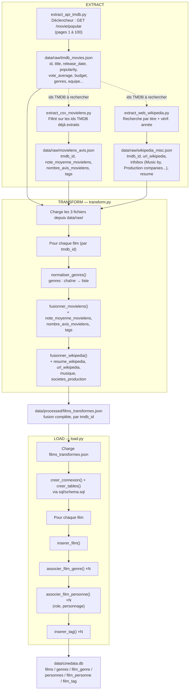
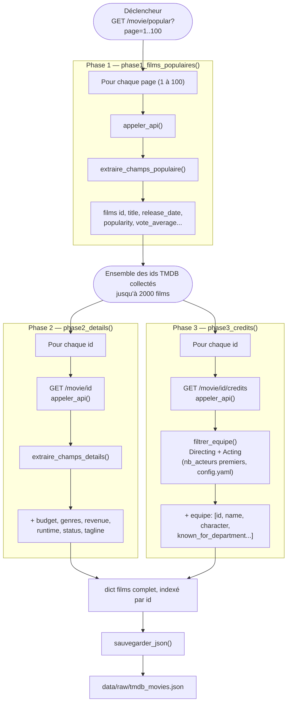
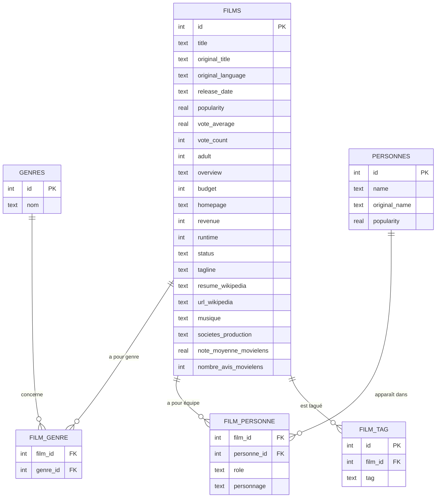

# Pipeline ETL — CinéData

Documentation du process ETL (Extract / Transform / Load) construit pour ce projet.
Les deux diagrammes Mermaid ci-dessous sont réutilisables tels quels dans le README final.
Noms de fichiers et dossiers alignés sur `config.yaml`.

## 1. Vue d'ensemble du pipeline

Trois branches d'extraction indépendantes convergent vers une étape de transformation unique, puis un chargement en base. **La branche API TMDB est la source principale et déclenche les deux autres** : `extract_csv_movielens.py` et `extract_web_wikipedia.py` se basent tous les deux sur la liste des identifiants de films déjà extraits par `extract_api_tmdb.py` (via `tmdb_movies.json`) pour savoir quels films rechercher/enrichir — ils ne traitent jamais l'intégralité de leur source.

## 2. Détail de l'extraction TMDB (3 phases)

Le déclencheur unique de tout le pipeline est l'appel à `/movie/popular`. Les identifiants de films qu'il retourne pilotent ensuite en cascade les deux phases suivantes — aucune autre source de la liste des films n'est utilisée.

## 3. Schéma de la base de données

Points de lecture :
- `note_moyenne_movielens`/`nombre_avis_movielens` restent des colonnes de `films` (relation 1-1, une seule valeur par film) — pas de table dédiée, contrairement aux tags qui sont multi-valués.
- `film_personne` porte `role` et `personnage` : ces deux colonnes décrivent l'apparition précise d'une personne dans un film donné, pas la personne elle-même (une même personne peut apparaître avec des rôles différents selon les films).
- Les `id` de `films` et `personnes` réutilisent directement l'identifiant TMDB — pas d'auto-incrément, puisque déjà uniques et stables.

## Logique générale

- **Déclencheur unique** : `/movie/popular`, seule route qui ne dépend d'aucun identifiant préalable.
- **Cascade par identifiant** : chaque phase/branche suivante consomme les ids produits en amont — jamais de traitement en aveugle d'une source entière (ex. `extract_csv_movielens.py` ne parcourt pas les 100 000 lignes de MovieLens, seulement celles liées à un film déjà extrait de TMDB).
- **`appeler_api()` / `requete_avec_retry()`** : point de passage unique pour tous les appels réseau de chaque script, avec gestion du rate limit (429) et des erreurs — un échec ponctuel n'interrompt jamais tout le pipeline.
- **Transform isolé du Load** : `transform.py` ne connaît rien de la base de données (il lit `data/raw/`, écrit `data/processed/films_transformes.json`) ; `load.py` ne fait aucune fusion (il lit `data/processed/`, écrit `data/cinedata.db`) — chacun a une seule responsabilité, conformément au découpage ETL validé.
- **Fusion en 3 étapes successives par film** (Transform) : normalisation des genres, puis enrichissement MovieLens, puis enrichissement Wikipedia — dans cet ordre, chaque étape ne touchant que les champs qui lui sont propres.
- **Chargement en 4 étapes par film** (Load) : le film lui-même, puis ses genres, puis son équipe (réalisateurs/acteurs avec rôle et personnage), puis ses tags — reflet direct des 6 tables du schéma.